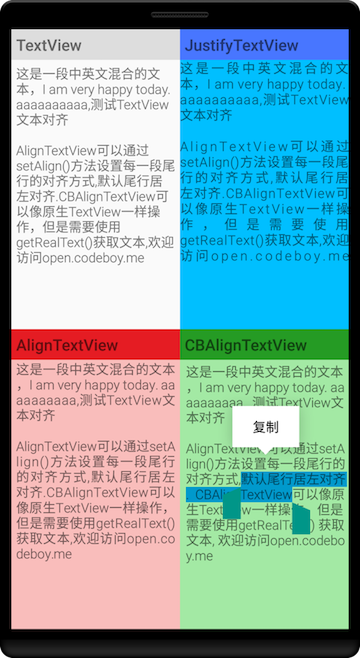

# AlignTextView
字体对齐的textview
  

  
## 系统要求
Android 4.0以上

## 快速使用

**CBAlignTextView (新的版本，支持选择复制，排版效果也比较的好)**

    <me.codeboy.android.lib.CBAlignTextView
            android:id="@+id/cbAlignTv"
            android:textIsSelectable="true"
            android:layout_width="match_parent"
            android:layout_height="wrap_content"/>

如果需要支持android默认的选择复制，请在xml中加入以下代码:

    android:textIsSelectable="true"

**AlignTextView (旧的版本，不支持选择复制，但是排版效果更好)**

     <me.codeboy.android.lib.AlignTextView
            android:id="@+id/alignTv"
            android:layout_width="match_parent"
            android:layout_height="wrap_content"/>

## 相关方法
CBAlignTextView中增加了以下方法获取TextView的文本内容，请不要使用getText()获取

    getRealText()

AlignTextView是旧的版本，不支持选择复制，但是可以自定义最后一行的对齐方式

	setAlign(Align align)
设置每一段最后一行对齐方式，默认居左对齐  
  
  
## 使用说明
1.  强烈建议使用CBAlignTextView而不是AlignTextView。
2.  AlignTextView与CBAlignTextView在对齐的时候不会对英文单词等进行考虑，它们都是以字符(character)为基础的,不是词(word)。
3.  demo项目位与app下，可以单独提取出me.codeboy.android.lib.AlignTextView和me.codeboy.android.lib.CBAlignTextView使用

## 更新历史

###2.0
1. 加入CBAlignTextView,支持原生TextView的选择复制。
2. 修改包名(域名更换了，欢迎访问<http://codeboy.me>)

###1.1
1. 修正由于对齐造成AlignTextView行数减少，从而下方留出空白。